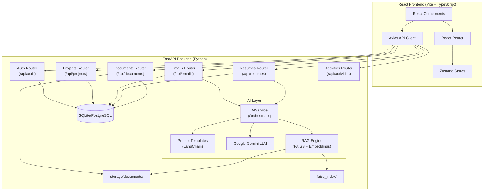
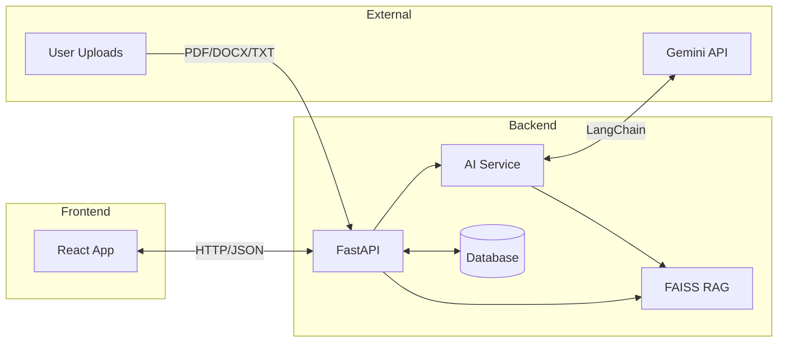
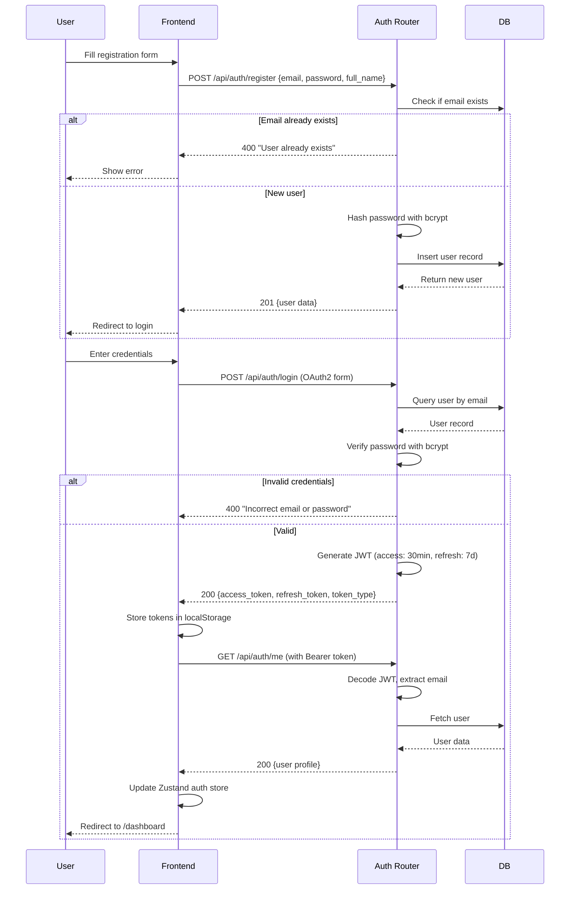
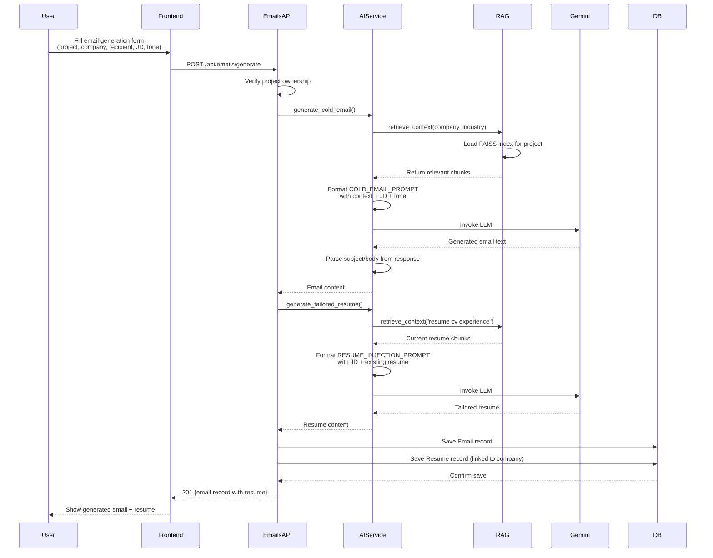
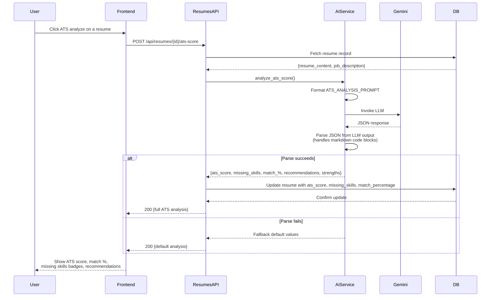
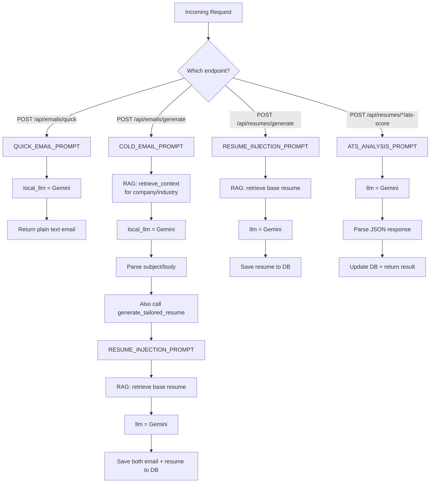
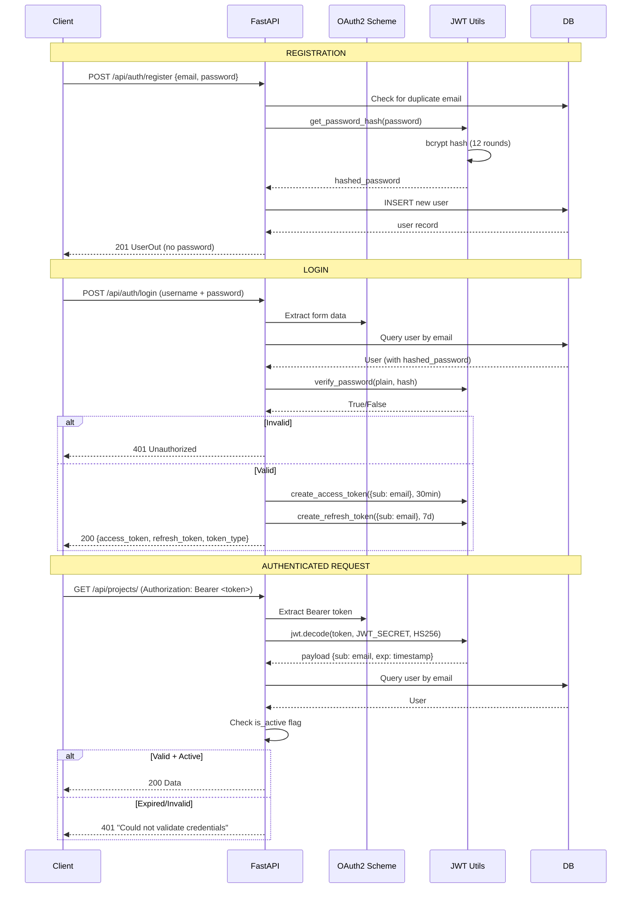
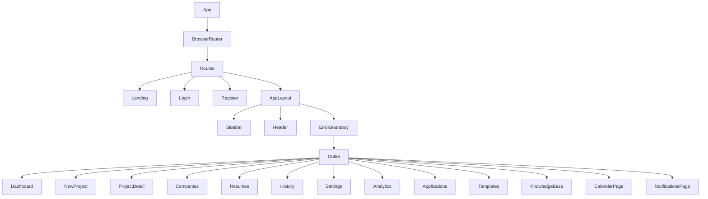

# AI Cold Email Generator Pro (ColdForge)

An enterprise-grade full-stack SaaS application that generates personalized cold emails, tailors resumes, and analyzes ATS compatibility using Google Gemini AI and Retrieval-Augmented Generation (RAG).

---

## Table of Contents

1. [System Architecture](#1-system-architecture)
2. [Request Flow Diagrams](#2-request-flow-diagrams)
3. [Data Models (Database Schema)](#3-data-models-database-schema)
4. [Pydantic Schemas (Request/Response Structures)](#4-pydantic-schemas-requestresponse-structures)
5. [API Endpoints Reference](#5-api-endpoints-reference)
6. [AI Prompt Templates (Text Tags)](#6-ai-prompt-templates-text-tags)
7. [Authentication & Security Flow](#7-authentication--security-flow)
8. [Frontend Architecture](#8-frontend-architecture)
9. [Tech Stack](#9-tech-stack)
10. [Setup Instructions](#10-setup-instructions)
11. [Directory Structure](#11-directory-structure)

---

## 1. System Architecture



### Component Interaction Flow



---

## 2. Request Flow Diagrams

### 2.1 User Registration & Login Flow



### 2.2 Email Generation Flow (with Resume)



### 2.3 ATS Analysis Flow



### 2.4 Document Upload & RAG Indexing Flow

```mermaid
sequenceDiagram
    participant User
    participant Frontend
    participant DocsAPI
    participant RAG
    participant FileSystem
    participant DB

    User->>Frontend: Upload document (PDF/DOCX/TXT)
    Frontend->>DocsAPI: POST /api/documents/ (multipart)
    DocsAPI->>DocsAPI: Verify project ownership
    DocsAPI->>FileSystem: Save file to storage/documents/
    FileSystem-->>DocsAPI: File saved
    DocsAPI->>RAG: add_document_to_index(filepath, project_id)
    RAG->>RAG: Load document via PyPDFLoader/Docx2txtLoader/TextLoader
    RAG->>RAG: Split into chunks (1000 chars, 100 overlap)
    RAG->>RAG: Generate embeddings via BAAI/bge-small-en-v1.5
    RAG->>FileSystem: Save/update FAISS index at faiss_index/project_{id}/
    FileSystem-->>RAG: Index saved
    RAG-->>DocsAPI: Done
    DocsAPI->>DB: Save document metadata
    DB-->>DocsAPI: Confirm
    DocsAPI-->>Frontend: 201 {document record}
    Frontend-->>User: Document added to Knowledge Base
```



---

## 3. Data Models (Database Schema)

### 3.1 User

Table: `users`

| Column | Type | Constraints | Description |
|--------|------|-------------|-------------|
| id | Integer | PK, auto-increment | Unique user ID |
| email | String | Unique, indexed, NOT NULL | User's email (also used as login username) |
| hashed_password | String | NOT NULL | bcrypt hashed password |
| full_name | String | Nullable | Display name |
| role | String | Default: "user" | "admin" or "user" |
| phone | String | Nullable | Contact number |
| linkedin | String | Nullable | LinkedIn profile URL |
| portfolio | String | Nullable | Portfolio website URL |
| bio | Text | Nullable | Short bio |
| settings | JSON | Nullable | User preferences (theme, etc.) |
| is_active | Boolean | Default: True | Account active flag |
| created_at | DateTime | Server default now() | Account creation timestamp |
| updated_at | DateTime | On update | Last profile update timestamp |

Relationships: `projects`, `emails`, `documents`, `companies`, `applications`, `templates`, `resumes`, `notifications`

### 3.2 Project

Table: `projects`

| Column | Type | Constraints | Description |
|--------|------|-------------|-------------|
| id | Integer | PK, auto-increment | Unique project ID |
| name | String | Indexed, NOT NULL | Campaign/project name |
| description | String | Nullable | Project description |
| user_id | Integer | FK -> users.id | Owner |
| created_at | DateTime | Server default now() | |
| updated_at | DateTime | On update | |

Relationships: `documents` (cascade delete), `emails` (cascade delete), `resumes`

### 3.3 Email

Table: `emails`

| Column | Type | Constraints | Description |
|--------|------|-------------|-------------|
| id | Integer | PK, auto-increment | |
| subject | String | | Generated email subject line |
| body | Text | NOT NULL | Generated email body |
| recipient_name | String | | Recipient's name |
| recipient_company | String | | Company name |
| job_id_referenced | String | | Job ID parsed from JD |
| job_description | Text | Nullable | The JD used for generation |
| generated_resume | Text | Nullable | Tailored resume generated alongside email |
| project_id | Integer | FK -> projects.id | Parent project |
| user_id | Integer | FK -> users.id | Owner |
| created_at | DateTime | Server default now() | |

Relationships: `project`, `user`

### 3.4 Resume

Table: `resumes`

| Column | Type | Constraints | Description |
|--------|------|-------------|-------------|
| id | Integer | PK, auto-increment | |
| company_name | String | NOT NULL | Target company |
| job_title | String | Nullable | Target role |
| job_description | Text | Nullable | The JD used for tailoring |
| resume_content | Text | NOT NULL | AI-generated resume content (Markdown) |
| ats_score | Float | Nullable | ATS compatibility score (0-100) |
| missing_skills | Text | Nullable | Comma-separated list of missing skills |
| match_percentage | Float | Nullable | Match % against JD |
| project_id | Integer | FK -> projects.id, Nullable | Associated project |
| user_id | Integer | FK -> users.id | Owner |
| created_at | DateTime | Server default now() | |

Relationships: `project`, `user`

### 3.5 Company

Table: `companies`

| Column | Type | Constraints | Description |
|--------|------|-------------|-------------|
| id | Integer | PK, auto-increment | |
| name | String | NOT NULL | Company name |
| logo_url | String | Nullable | Logo URL |
| website | String | Nullable | Website URL |
| industry | String | Nullable | Industry sector |
| location | String | Nullable | HQ location |
| notes | Text | Nullable | User notes |
| user_id | Integer | FK -> users.id | Owner |
| created_at | DateTime | Server default now() | |

Relationships: `user`, `applications`

### 3.6 Application

Table: `applications`

| Column | Type | Constraints | Description |
|--------|------|-------------|-------------|
| id | Integer | PK, auto-increment | |
| job_role | String | NOT NULL | Job title |
| status | String | Default: "Draft" | Draft, Applied, Interviewing, Offer, Rejected |
| salary_range | String | Nullable | |
| employment_type | String | Nullable | Full-time, Contract, etc. |
| date_applied | DateTime | Nullable | |
| source | String | Nullable | LinkedIn, Careers Page, etc. |
| recruiter_name | String | Nullable | |
| recruiter_contact | String | Nullable | |
| hr_contact | String | Nullable | |
| notes | Text | Nullable | |
| resume_id | Integer | FK -> documents.id, Nullable | Linked resume doc |
| email_id | Integer | FK -> emails.id, Nullable | Linked email |
| company_id | Integer | FK -> companies.id, NOT NULL | |
| user_id | Integer | FK -> users.id, NOT NULL | |
| project_id | Integer | FK -> projects.id, Nullable | |
| created_at | DateTime | Server default now() | |
| updated_at | DateTime | On update | |

Relationships: `company`, `user`, `project`, `resume` (Document), `email` (Email)

### 3.7 Document

Table: `documents`

| Column | Type | Constraints | Description |
|--------|------|-------------|-------------|
| id | Integer | PK, auto-increment | |
| filename | String | NOT NULL | Original filename |
| filepath | String | NOT NULL | Server storage path |
| doc_type | String | Nullable | resume, company_profile, product_catalog, job_description |
| project_id | Integer | FK -> projects.id, NOT NULL | |
| user_id | Integer | FK -> users.id, NOT NULL | |
| created_at | DateTime | Server default now() | |

Relationships: `project`, `user`

### 3.8 Template

Table: `templates`

| Column | Type | Constraints | Description |
|--------|------|-------------|-------------|
| id | Integer | PK, auto-increment | |
| name | String | NOT NULL | Template name |
| description | String | Nullable | |
| content | Text | NOT NULL | Template body |
| user_id | Integer | FK -> users.id, Nullable | Null = global template |
| created_at | DateTime | Server default now() | |
| updated_at | DateTime | On update | |

Relationships: `user`

### 3.9 Notification

Table: `notifications`

| Column | Type | Constraints | Description |
|--------|------|-------------|-------------|
| id | Integer | PK, auto-increment | |
| title | String | NOT NULL | Notification title |
| message | Text | NOT NULL | Notification body |
| type | String | Default: "info" | info, warning, success, error |
| is_read | Boolean | Default: False | Read status |
| user_id | Integer | FK -> users.id | |
| created_at | DateTime | Server default now() | |

### 3.10 Activity

Table: `activities`

| Column | Type | Constraints | Description |
|--------|------|-------------|-------------|
| id | Integer | PK, auto-increment | |
| type | String | NOT NULL | email_sent, resume_generated, doc_uploaded, etc. |
| description | Text | NOT NULL | Activity description |
| project_id | Integer | FK -> projects.id | |
| user_id | Integer | FK -> users.id | |
| created_at | DateTime | Server default now() | |

---

## 4. Pydantic Schemas (Request/Response Structures)

### 4.1 Auth Schemas

```json
POST /api/auth/register  (Request Body)
{
  "email": "user@example.com",      // EmailStr: valid email
  "password": "securepass123",      // str: plaintext, hashed by bcrypt
  "full_name": "John Doe"           // Optional[str]
}

POST /api/auth/login  (OAuth2 Form Data)
{
  "username": "user@example.com",   // str: email used as username
  "password": "securepass123"       // str
}

Response (Token)
{
  "access_token": "eyJhbG...",     // JWT: 30 min expiry
  "refresh_token": "eyJhbG...",    // JWT: 7 day expiry
  "token_type": "bearer"
}

GET /api/auth/me  (Response - UserOut)
{
  "id": 1,
  "email": "user@example.com",
  "full_name": "John Doe",
  "role": "user",
  "phone": null,
  "linkedin": null,
  "portfolio": null,
  "bio": null,
  "settings": null,
  "is_active": true,
  "created_at": "2026-07-29T10:00:00Z"
}
```

### 4.2 Email Generation Schemas

```json
POST /api/emails/generate  (Request Body - EmailGenerateRequest)
{
  "project_id": 1,                  // int: must exist and belong to user
  "recipient_name": "Jane Smith",   // str
  "company_name": "Google",         // str
  "industry": "Technology",         // str
  "pain_points": "hiring delays",   // str
  "job_description": "We are looking for...",  // str: full JD text
  "job_id": "REF-123",             // Optional[str]: parsed from JD
  "tone": "Professional"           // Optional[str]: default "Professional"
}

Response (EmailOut)
{
  "id": 1,
  "subject": "Subject: Improving your hiring pipeline...",
  "body": "Dear Jane...",
  "recipient_name": "Jane Smith",
  "recipient_company": "Google",
  "job_id_referenced": "REF-123",
  "job_description": "We are looking for...",
  "generated_resume": "## John Doe\n\n### Summary\n...",
  "project_id": 1,
  "created_at": "2026-07-29T10:00:00Z"
}
```

### 4.3 Resume Schemas

```json
POST /api/resumes/generate  (Request Body - ResumeGenerateRequest)
{
  "company_name": "Google",         // str
  "job_title": "Senior Engineer",   // Optional[str]
  "job_description": "We need...",  // str: full JD
  "project_id": 1                   // Optional[int]
}

POST /api/resumes/ats-score  (Request Body - ATSAnalysisRequest)
{
  "resume_content": "## John Doe\n\n...",  // str
  "job_description": "We are looking..."   // str
}

Response (ATSAnalysisResponse)
{
  "ats_score": 72.5,                  // float (0-100): overall ATS compatibility
  "missing_skills": [                 // string[]: skills in JD not in resume
    "Kubernetes",
    "Terraform",
    "GraphQL"
  ],
  "match_percentage": 65.0,          // float (0-100): % of requirements matched
  "recommendations": [                // string[]: actionable improvement tips
    "Add Kubernetes experience to your resume",
    "Highlight any cloud infrastructure work"
  ],
  "strengths": [                      // string[]: strongest matching areas
    "Strong backend development experience",
    "Excellent Python and Go skills"
  ]
}

Response (ResumeOut)
{
  "id": 1,
  "company_name": "Google",
  "job_title": "Senior Engineer",
  "job_description": "We need...",
  "resume_content": "## John Doe\n\n...",
  "ats_score": 72.5,
  "missing_skills": "Kubernetes, Terraform, GraphQL",
  "match_percentage": 65.0,
  "project_id": 1,
  "created_at": "2026-07-29T10:00:00Z"
}
```

### 4.4 Project Schemas

```json
POST /api/projects/  (Request Body - ProjectCreate)
{
  "name": "Google Campaign Q3",     // str
  "description": "Targeting Google"  // Optional[str]
}

Response (ProjectOut)
{
  "id": 1,
  "name": "Google Campaign Q3",
  "description": "Targeting Google",
  "user_id": 1,
  "created_at": "2026-07-29T10:00:00Z",
  "updated_at": null
}
```

---

## 5. API Endpoints Reference

### 5.1 Authentication (`/api/auth`)

| Method | Path | Auth | Request | Response | Description |
|--------|------|------|---------|----------|-------------|
| POST | `/api/auth/register` | No | `UserCreate` body | `UserOut` (201) | Create new user account |
| POST | `/api/auth/login` | No | OAuth2 form | `Token` (200) | Login, returns JWT pair |
| GET | `/api/auth/me` | Yes | - | `UserOut` (200) | Get current user profile |
| PUT | `/api/auth/me` | Yes | `UserUpdate` body | `UserOut` (200) | Update profile (supports password change) |

### 5.2 Projects (`/api/projects`)

| Method | Path | Auth | Request | Response | Description |
|--------|------|------|---------|----------|-------------|
| GET | `/api/projects/` | Yes | - | `List[ProjectOut]` | List user's projects |
| POST | `/api/projects/` | Yes | `ProjectCreate` | `ProjectOut` (201) | Create project |
| GET | `/api/projects/{id}` | Yes | - | `ProjectOut` | Get project details |
| PUT | `/api/projects/{id}` | Yes | `ProjectUpdate` | `ProjectOut` | Update project |
| DELETE | `/api/projects/{id}` | Yes | - | 204 No Content | Delete project (cascades) |

### 5.3 Emails (`/api/emails`)

| Method | Path | Auth | Request | Response | Description |
|--------|------|------|---------|----------|-------------|
| POST | `/api/emails/quick` | Yes | `QuickEmailRequest` {role} | `QuickEmailResponse` | Quick email by role name only |
| POST | `/api/emails/generate` | Yes | `EmailGenerateRequest` | `EmailOut` (201) | Full generation with RAG + resume + auto-create Resume record |
| GET | `/api/emails/project/{id}` | Yes | - | `List[EmailOut]` | List project emails |
| GET | `/api/emails/{id}` | Yes | - | `EmailOut` | Get single email |
| PUT | `/api/emails/{id}` | Yes | `EmailUpdate` {subject} | `EmailOut` | Update email subject |
| DELETE | `/api/emails/{id}` | Yes | - | 204 | Delete email |

### 5.4 Resumes (`/api/resumes`)

| Method | Path | Auth | Request | Response | Description |
|--------|------|------|---------|----------|-------------|
| POST | `/api/resumes/generate` | Yes | `ResumeGenerateRequest` | `ResumeOut` (201) | Generate tailored resume from JD |
| GET | `/api/resumes/` | Yes | - | `List[ResumeOut]` | List all user's resumes |
| GET | `/api/resumes/company/{name}` | Yes | - | `List[ResumeOut]` | Filter by company name (case-insensitive) |
| GET | `/api/resumes/{id}` | Yes | - | `ResumeOut` | Get single resume |
| PUT | `/api/resumes/{id}` | Yes | `ResumeUpdate` | `ResumeOut` | Update content/title |
| DELETE | `/api/resumes/{id}` | Yes | - | 204 | Delete resume |
| POST | `/api/resumes/ats-score` | Yes | `ATSAnalysisRequest` | `ATSAnalysisResponse` | Analyze any resume+JD pair |
| POST | `/api/resumes/{id}/ats-score` | Yes | - | `ATSAnalysisResponse` | Analyze saved resume, auto-updates score fields |

### 5.5 Documents (`/api/documents`)

| Method | Path | Auth | Request | Response | Description |
|--------|------|------|---------|----------|-------------|
| POST | `/api/documents/` | Yes | Multipart file + project_id | `DocumentOut` (201) | Upload, parse, chunk, index into FAISS |
| GET | `/api/documents/project/{id}` | Yes | - | `List[DocumentOut]` | List project documents |
| PUT | `/api/documents/{id}` | Yes | `DocumentUpdate` {filename} | `DocumentOut` | Update filename |
| DELETE | `/api/documents/{id}` | Yes | - | 204 | Delete document metadata (index remains) |

### 5.6 Activities (`/api/activities`)

| Method | Path | Auth | Request | Response | Description |
|--------|------|------|---------|----------|-------------|
| GET | `/api/activities/` | Yes | - | `List[ActivityOut]` | List user activities |
| POST | `/api/activities/` | Yes | `ActivityCreate` | `ActivityOut` (201) | Create activity log |
| PUT | `/api/activities/{id}` | Yes | `ActivityUpdate` | `ActivityOut` | Update activity |
| DELETE | `/api/activities/{id}` | Yes | - | 204 | Delete activity |

### 5.7 Health

| Method | Path | Auth | Response | Description |
|--------|------|------|----------|-------------|
| GET | `/` | No | `{status, message}` | API root |
| GET | `/health` | No | `{status, timestamp, version}` | Health check |

---

## 6. AI Prompt Templates (Text Tags)

The application uses 4 LangChain `PromptTemplate` definitions, each serving a distinct purpose. Below is each prompt with its input variables, the exact text template, and the rationale for its structure.

### 6.1 COLD_EMAIL_PROMPT

**File:** `backend/app/ai/prompts/email_prompts.py`  
**Used for:** Generating full cold emails with RAG context  
**Input variables:** `context`, `recipient_name`, `company_name`, `industry`, `pain_points`, `job_id`, `job_description`, `tone`

```
You are an expert sales and marketing copywriter specializing in high-converting cold emails.
Your goal is to write a personalized cold email based on the provided context, instructions, and job description.

Context about our company and product (from our knowledge base):
{context}

Job Description (for the role they are hiring for):
{job_description}

Recipient Information:
- Name: {recipient_name}
- Company: {company_name}
- Industry: {industry}
- Job ID (if known, otherwise extract from JD): {job_id}
- Known Pain Points: {pain_points}

Instructions:
1. Write a compelling subject line.
2. Tone should be: {tone}.
3. The email must be highly personalized. Use the recipient's name and company.
4. If a Job ID or Job Reference is provided or found in the Job Description, mention it explicitly and naturally.
5. Clearly state the value proposition based on the Context provided.
6. Include a clear Call to Action (CTA).
7. Keep it concise, professional, and easy to read.

Output Format:
Subject: [Your Subject Line]

[Body of the email]
```

**Why these text tags were used:**

| Tag | Purpose |
|-----|---------|
| `{context}` | **RAG injection point.** Holds retrieved document chunks from FAISS. This makes the email specific to the user's actual products/services rather than generic. |
| `{recipient_name}` | **Personalization.** Cold emails with recipient names have 2-3x higher open rates. |
| `{company_name}` | **Company-specific tailoring.** Allows mentioning the target company naturally. |
| `{industry}` | **Industry context.** Helps the AI use appropriate terminology and understand the domain. |
| `{pain_points}` | **Problem-aware targeting.** The user specifies known pain points; the AI addresses them directly. |
| `{job_id}` | **Role specificity.** When applying to a specific job posting, referencing the job ID makes the email feel targeted. |
| `{job_description}` | **Role context.** The AI sees what skills/qualifications are needed and can align the pitch accordingly. |
| `{tone}` | **Style control.** User can choose Professional, Friendly, Bold, etc. The AI adjusts vocabulary and sentence structure. |

**Why the output format is "Subject: ...\n\nBody":** The backend splits on the first line starting with "Subject:" to extract the subject line into a separate database column (`email.subject`) while storing the rest as `email.body`. This dual storage enables the frontend to display subject lines in inbox-style lists.

### 6.2 RESUME_INJECTION_PROMPT

**File:** `backend/app/ai/prompts/email_prompts.py`  
**Used for:** Tailoring a resume to match a specific job description  
**Input variables:** `job_description`, `current_resume`

```
You are an expert technical recruiter and resume writer.
Your task is to extract relevant skills from a Job Description and intelligently integrate them into a candidate's current resume.

Job Description:
{job_description}

Current Resume:
{current_resume}

Instructions:
1. Analyze the Job Description and extract the key skills and keywords.
2. Review the Current Resume.
3. Generate an updated version of the resume that highlights these extracted skills.
   Do not lie or invent experience, but reframe the existing experience to better align with the job description.
4. Output the updated resume in Markdown format.
```

**Why these text tags were used:**

| Tag | Purpose |
|-----|---------|
| `{job_description}` | **Target role requirements.** The AI analyzes which skills, technologies, and experiences the employer wants. |
| `{current_resume}` | **Base document.** Retrieved from the user's knowledge base (RAG). The AI uses this as the source of truth. |

**Why Markdown output:** Markdown is human-readable, can be rendered in the frontend, exported as .md files, and can be easily converted to PDF/HTML by tools like Pandoc. It's a universal format for resume content.

### 6.3 ATS_ANALYSIS_PROMPT

**File:** `backend/app/ai/prompts/email_prompts.py`  
**Used for:** ATS compatibility scoring, missing skills detection, and recommendations  
**Input variables:** `resume_content`, `job_description`

```
You are an expert ATS (Applicant Tracking System) analyst and career coach.
Your task is to analyze a candidate's resume against a job description and provide detailed scoring.

Job Description:
{job_description}

Resume:
{resume_content}

Analyze the resume against the job description and return a JSON object with the following fields:
1. "ats_score": A float between 0 and 100 representing the overall ATS compatibility score.
2. "missing_skills": An array of strings listing important skills mentioned in the JD that are missing or insufficiently addressed in the resume.
3. "match_percentage": A float between 0 and 100 representing the percentage of key requirements matched.
4. "recommendations": An array of strings with actionable recommendations to improve the resume for this specific job.
5. "strengths": An array of strings highlighting the strongest matching areas of the resume against the JD.

Return ONLY valid JSON, no other text.
```

**Why these text tags were used:**

| Tag | Purpose |
|-----|---------|
| `{resume_content}` | **The candidate's resume.** Analyzed for keyword presence, experience relevance, and formatting. |
| `{job_description}` | **The benchmark.** The AI compares every requirement in the JD against what the resume presents. |

**Why structured JSON output:** The backend parses this JSON to populate the `ATSAnalysisResponse` schema. Each field serves a specific user-facing purpose:

| JSON Field | Purpose |
|------------|---------|
| `ats_score` | **Quick overview.** A single number (0-100) that tells the user how ATS-friendly their resume is for this role. Color-coded: 80+ green (good), 60-79 yellow (needs work), <60 red (poor). |
| `missing_skills` | **Gap analysis.** Displayed as colored "missing" badges. Helps the user know exactly what to add. |
| `match_percentage` | **Shortlist probability.** Indicates how many key requirements are already met. Higher = better chance of getting shortlisted. |
| `recommendations` | **Actionable steps.** Each recommendation is a specific action the user can take (e.g., "Add your Kubernetes experience to the Skills section"). |
| `strengths` | **Positive reinforcement.** Shows what the resume already does well to boost confidence. |

The instruction "Return ONLY valid JSON, no other text" is critical because the backend uses `json.loads()` to parse the response. If the LLM wraps the JSON in markdown code blocks, a `regex` fallback strips them: `re.search(r'```(?:json)?\s*([\s\S]*?)\s*```', content)`.

### 6.4 QUICK_EMAIL_PROMPT

**File:** `backend/app/ai/prompts/email_prompts.py`  
**Used for:** Rapid cold email generation by role name only (no RAG, no JD)  
**Input variables:** `role`

```
You are an expert career coach and cold email writer.
Write a short, crisp, and highly effective cold email applying for a {role} position.
Do not use any placeholders that require the user to look up information.
Keep it under 150 words.
The email should highlight relevant skills, enthusiasm for the role, and a clear call to action.

Output Format:
Subject: [Your Subject Line]

[Body of the email]
```

**Why this prompt exists separately:** The Quick Email feature is designed for speed -- the user types a role name (e.g., "Software Engineer") and gets an email instantly without needing to upload documents or fill long forms. The constraint "under 150 words" ensures the output stays brief and scannable. The instruction "Do not use any placeholders" prevents the AI from generating `[Your Name]` or `[Company Name]` tokens that would require manual editing.

### 6.5 How the AI Service Chooses Which Prompt



Two LLM instances exist:
- `self.llm` (Gemini 1.5 Pro) -- used for complex tasks: resume tailoring and ATS analysis
- `self.local_llm` (same Gemini client, previously for local Ollama) -- used for email generation

---

## 7. Authentication & Security Flow



### Security Measures

| Layer | Technology | Details |
|-------|-----------|---------|
| Password Hashing | bcrypt (passlib) | 12 rounds, salt auto-generated |
| Token Signing | HS256 (python-jose) | JWT with `exp` claim |
| Token Separation | Access + Refresh | Access: 30min, Refresh: 7 days |
| Password Policy | Server-enforced | Min length validated by Pydantic |
| CORS | FastAPI CORSMiddleware | Regex-based origin allowlist |
| Rate Limiting | slowapi | Per-endpoint rate limits |
| Input Validation | Pydantic v2 | Type coercion + validation on all endpoints |
| SQL Injection | SQLAlchemy ORM | Parameterized queries throughout |

---

## 8. Frontend Architecture

### 8.1 Component Tree



### 8.2 State Management (Zustand Stores)

```
useAuthStore:
  State:    user, isAuthenticated, isLoading
  Actions:  login(), logout(), fetchUser()
  
useThemeStore:
  State:    theme ("dark" | "light")
  Actions:  toggleTheme()
```

### 8.3 API Client (Axios Interceptors)

```
Request Interceptor:
  localStorage.getItem("access_token")
  -> config.headers.Authorization = "Bearer <token>"
  
Response Interceptor:
  (placeholder for refresh token logic)
```

### 8.4 Route Protection

The `AppLayout` component acts as an auth guard:
1. Checks `isAuthenticated` from Zustand store
2. If false, redirects to `/login`
3. If true but `user` is null, calls `fetchUser()`
4. Shows loading spinner while checking

---

## 9. Tech Stack

### Backend

| Component | Technology | Purpose |
|-----------|-----------|---------|
| Framework | FastAPI (Python 3.11+) | Async API server with auto-docs |
| ORM | SQLAlchemy 2.0 | Database abstraction |
| Migrations | Alembic | Schema version control |
| Database | SQLite (dev) / PostgreSQL (prod) | Primary data store |
| Auth | python-jose + passlib (bcrypt) | JWT tokens + password hashing |
| AI SDK | LangChain | LLM orchestration + prompt management |
| LLM | Google Gemini 1.5 Pro (via langchain-google-genai) | Text generation |
| Vector DB | FAISS (faiss-cpu) | Similarity search for RAG |
| Embeddings | BAAI/bge-small-en-v1.5 (HuggingFace) | Document embeddings |
| Document Parsing | PyPDF2, python-docx, docx2txt, TextLoader | File format support |
| Rate Limiting | slowapi | API rate protection |
| Validation | Pydantic v2 | Request/response schema validation |

### Frontend

| Component | Technology | Purpose |
|-----------|-----------|---------|
| Framework | React 19 + TypeScript 6 | UI library |
| Build Tool | Vite 8 | Dev server + bundling |
| Styling | Tailwind CSS 3 + tw-animate-css | Utility-first CSS |
| UI Primitives | @base-ui/react + shadcn/ui | Accessible headless components |
| Icons | lucide-react | SVG icon library |
| Routing | React Router DOM v7 | Client-side routing |
| State | Zustand 5 | Lightweight global state |
| HTTP | Axios | API client with interceptors |
| Forms | react-hook-form + zod | Form validation |
| Animation | framer-motion 12 + GSAP 3 + Lenis | UI animations |
| 3D | Three.js + @react-three/fiber + drei | 3D visuals (Landing page) |
| Testing | Vitest + Testing Library | Unit/component testing |

---

## 10. Setup Instructions

### Prerequisites

- Python 3.11+
- Node.js 20+
- Google Gemini API key (get from [Google AI Studio](https://aistudio.google.com/))

### Step 1: Clone and Configure Environment

```bash
# Copy environment files
cp .env.example .env
cp backend/.env.example backend/.env
cp frontend/.env.example frontend/.env

# Edit backend/.env with your settings:
#   GEMINI_API_KEY=your_key_here
#   JWT_SECRET=your_random_secret
#   JWT_REFRESH_SECRET=your_random_refresh_secret
```

### Step 2: Backend Setup

```bash
cd backend
python -m venv venv
.\venv\Scripts\activate  # Windows
pip install -r requirements.txt
alembic upgrade head      # Run migrations
uvicorn app.main:app --reload
```

### Step 3: Frontend Setup

```bash
cd frontend
npm install
npm run dev
```

### Step 4: Run with Scripts (Windows)

Double-click `run.bat` or run:
```powershell
.\run.ps1
```

### Testing

```bash
cd backend
.\venv\Scripts\activate
pytest tests/test_api_endpoints.py -v
```

---

## 11. Directory Structure

```
├── backend/
│   ├── alembic/                    # DB migration scripts
│   │   └── versions/              # Individual migration files
│   ├── app/
│   │   ├── ai/
│   │   │   ├── gemini_client.py   # Gemini LLM initialization
│   │   │   ├── prompts/
│   │   │   │   └── email_prompts.py  # All 4 LangChain prompt templates
│   │   │   └── rag/
│   │   │       └── engine.py      # FAISS vector store + document loading
│   │   ├── api/
│   │   │   ├── activities.py      # Activity CRUD endpoints
│   │   │   ├── documents.py       # Document upload + RAG indexing
│   │   │   ├── emails.py          # Email generation + CRUD
│   │   │   ├── projects.py        # Project CRUD
│   │   │   └── resumes.py         # Resume generation + ATS analysis
│   │   ├── auth/
│   │   │   ├── jwt.py             # JWT create/verify + password hashing
│   │   │   └── router.py          # Register/login/me endpoints
│   │   ├── config.py              # Pydantic settings (env vars)
│   │   ├── database.py            # SQLAlchemy engine + session
│   │   ├── limiter.py             # Rate limiter setup
│   │   ├── main.py                # FastAPI app + router registration
│   │   ├── middleware/
│   │   │   └── error_handler.py   # Global exception handlers
│   │   ├── models/                # SQLAlchemy ORM models
│   │   │   ├── __init__.py        # Exports all models
│   │   │   ├── activity.py
│   │   │   ├── application.py
│   │   │   ├── company.py
│   │   │   ├── document.py
│   │   │   ├── email.py
│   │   │   ├── notification.py
│   │   │   ├── project.py
│   │   │   ├── reminder.py
│   │   │   ├── resume.py
│   │   │   ├── template.py
│   │   │   └── user.py
│   │   ├── schemas/               # Pydantic request/response models
│   │   │   ├── activity.py
│   │   │   ├── document.py
│   │   │   ├── email.py
│   │   │   ├── project.py
│   │   │   ├── resume.py
│   │   │   └── user.py
│   │   ├── services/
│   │   │   └── ai_service.py      # AI orchestration (singleton)
│   │   └── utils/
│   ├── faiss_index/               # Per-project FAISS vector indices
│   ├── storage/documents/         # Uploaded file storage
│   ├── tests/
│   │   └── test_api_endpoints.py
│   ├── requirements.txt
│   └── .env.example
│
├── frontend/
│   ├── src/
│   │   ├── components/
│   │   │   ├── ErrorBoundary.tsx
│   │   │   └── layout/
│   │   │       └── AppLayout.tsx  # Sidebar + header + auth guard
│   │   ├── lib/
│   │   │   └── api.ts             # Axios instance with interceptors
│   │   ├── pages/
│   │   │   ├── Analytics.tsx
│   │   │   ├── Applications.tsx
│   │   │   ├── CalendarPage.tsx
│   │   │   ├── Companies.tsx
│   │   │   ├── Dashboard.tsx
│   │   │   ├── History.tsx
│   │   │   ├── KnowledgeBase.tsx
│   │   │   ├── Landing.tsx
│   │   │   ├── Login.tsx
│   │   │   ├── NewProject.tsx
│   │   │   ├── NotificationsPage.tsx
│   │   │   ├── ProjectDetail.tsx
│   │   │   ├── Register.tsx
│   │   │   ├── Resumes.tsx
│   │   │   ├── Settings.tsx
│   │   │   └── Templates.tsx
│   │   ├── store/
│   │   │   ├── useAuthStore.ts    # Zustand auth state
│   │   │   └── useThemeStore.ts   # Zustand theme state
│   │   ├── App.tsx                # Root component + routes
│   │   ├── main.tsx               # Entry point
│   │   └── index.css              # Tailwind base + CSS variables
│   ├── public/
│   ├── package.json
│   ├── vite.config.ts
│   ├── tailwind.config.js
│   └── .env.example
│
├── Doc/                           # Architecture diagrams + docs
├── run.bat                        # Windows launch script
├── run.ps1                        # PowerShell launch script
├── .env.example                   # Docker environment
└── README.md                      # This file
```

---

*Generated for the AI Cold Email Generator Pro (ColdForge) project. Last updated: July 2026.*
