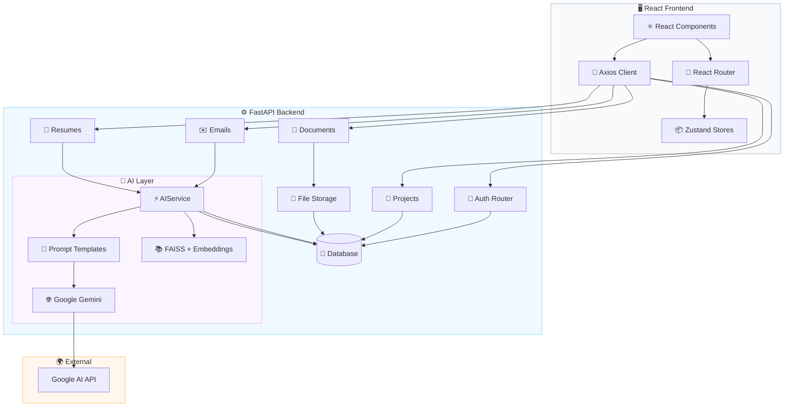
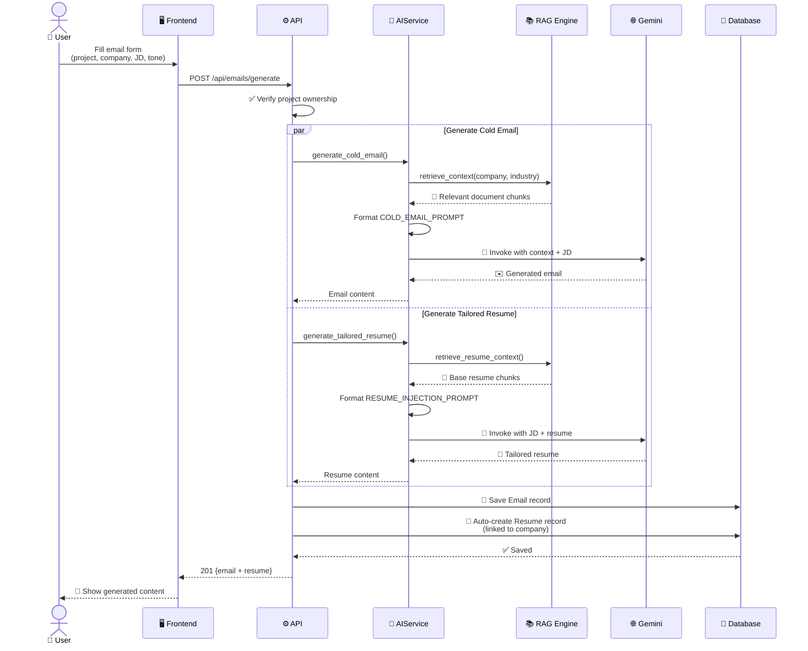
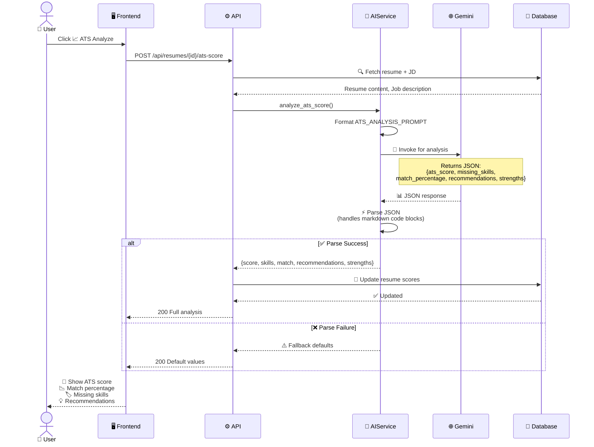
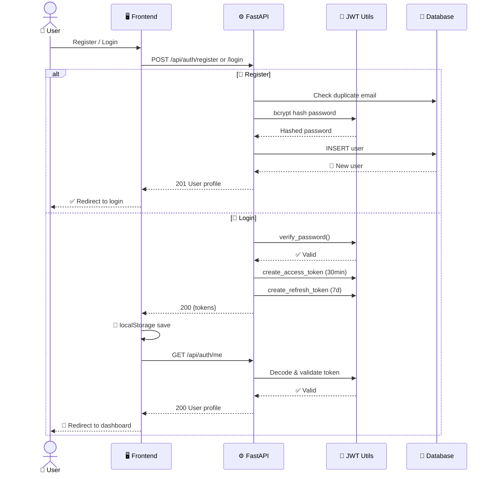
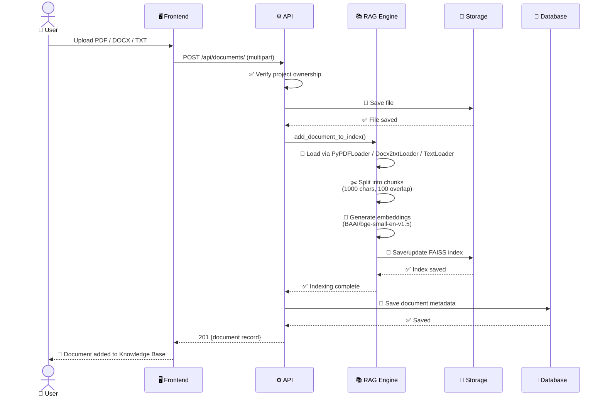
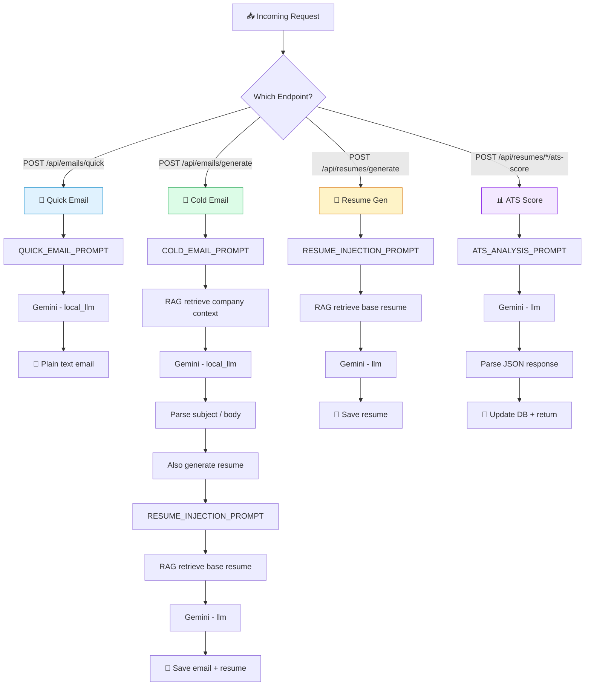

<p align="center">
  <br/>
  
  
  
  <br/>
  <br/>
  
  
  
  
  
  
</p>

<div align="center">
  <br/>
  
  # ✦ AI Cold Email Generator Pro ✦
  
  ### *ColdForge — Enterprise SaaS Platform*
  
  <br/>
  
  <p><i>A full-stack AI-powered platform that generates personalized cold emails, crafts tailored resumes, and predicts ATS compatibility using Google Gemini and Retrieval-Augmented Generation.</i></p>
  
  <br/>
  
  <kbd> [ 🚀 Live Demo ] </kbd> &nbsp;
  <kbd> [ 📖 API Docs ] </kbd> &nbsp;
  <kbd> [ 🐛 Report Bug ] </kbd>
  
  <br/>
  <br/>
</div>

---

<div align="center">
  
## 📋 Table of Contents
  
[Architecture](#-architecture) &nbsp;•&nbsp; [Flow Diagrams](#-flow-diagrams) &nbsp;•&nbsp; [Data Models](#-data-models) &nbsp;•&nbsp; [API Reference](#-api-reference) &nbsp;•&nbsp; [AI Prompts](#-ai-prompts) &nbsp;•&nbsp; [Setup](#-setup) &nbsp;•&nbsp; [Structure](#-structure)
  
</div>

---

<br/>

## 🏗 Architecture

<div align="center">
  


</div>

<br/>

---

## 🔄 Flow Diagrams

<br/>

### ✉️ Email Generation Flow

<div align="center">



</div>

<br/>

### 📊 ATS Score Analysis Flow

<div align="center">



</div>

<br/>

### 🔐 Authentication Flow

<div align="center">



</div>

<br/>

### 📎 Document Upload & RAG Indexing Flow

<div align="center">



</div>

<br/>

### 🧠 Prompt Selection Flow

<div align="center">



</div>

<br/>

---

## 📊 Data Models

<br/>

### 👤 User — `users`

| Column | Type | Constraints | Description |
|--------|------|-------------|-------------|
| `id` | `Integer` | 🔑 PK, Auto | Unique identifier |
| `email` | `String` | 🔷 Unique, Indexed, NOT NULL | Login email |
| `hashed_password` | `String` | 🔒 NOT NULL | bcrypt hash |
| `full_name` | `String` | ➖ Nullable | Display name |
| `role` | `String` | 📛 Default: `"user"` | `admin` / `user` |
| `phone` | `String` | ➖ Nullable | Contact |
| `linkedin` | `String` | ➖ Nullable | Profile URL |
| `portfolio` | `String` | ➖ Nullable | Website |
| `bio` | `Text` | ➖ Nullable | Short bio |
| `settings` | `JSON` | ⚙️ Nullable | Preferences |
| `is_active` | `Boolean` | ✅ Default: `True` | Soft disable |
| `created_at` | `DateTime` | 📅 Server default | |
| `updated_at` | `DateTime` | 🔄 On update | |

**Relationships:** `projects`, `emails`, `documents`, `companies`, `applications`, `templates`, `resumes`, `notifications`

<br/>

### 📁 Project — `projects`

| Column | Type | Constraints | Description |
|--------|------|-------------|-------------|
| `id` | `Integer` | 🔑 PK, Auto | |
| `name` | `String` | 🔷 Indexed, NOT NULL | Campaign name |
| `description` | `String` | ➖ Nullable | |
| `user_id` | `Integer` | 🔗 FK → `users.id` | Owner |
| `created_at` | `DateTime` | 📅 Server default | |
| `updated_at` | `DateTime` | 🔄 On update | |

**Relationships:** `documents` (cascade), `emails` (cascade), `resumes`

<br/>

### ✉️ Email — `emails`

| Column | Type | Constraints | Description |
|--------|------|-------------|-------------|
| `id` | `Integer` | 🔑 PK, Auto | |
| `subject` | `String` | ➖ | Extracted subject line |
| `body` | `Text` | 📝 NOT NULL | Generated email body |
| `recipient_name` | `String` | ➖ | Target person |
| `recipient_company` | `String` | ➖ | Target company |
| `job_id_referenced` | `String` | ➖ | Job ID from JD |
| `job_description` | `Text` | ➖ Nullable | Source JD |
| `generated_resume` | `Text` | ➖ Nullable | AI-tailored resume |
| `project_id` | `Integer` | 🔗 FK → `projects.id` | Parent |
| `user_id` | `Integer` | 🔗 FK → `users.id` | Owner |
| `created_at` | `DateTime` | 📅 Server default | |

<br/>

### 📄 Resume — `resumes`

| Column | Type | Constraints | Description |
|--------|------|-------------|-------------|
| `id` | `Integer` | 🔑 PK, Auto | |
| `company_name` | `String` | 🏢 NOT NULL | Target company |
| `job_title` | `String` | ➖ Nullable | Target role |
| `job_description` | `Text` | ➖ Nullable | Source JD |
| `resume_content` | `Text` | 📝 NOT NULL | AI resume (Markdown) |
| `ats_score` | `Float` | 📊 Nullable | 0–100 ATS score |
| `missing_skills` | `Text` | 🏷 Nullable | Comma-separated gaps |
| `match_percentage` | `Float` | 📈 Nullable | % matched |
| `project_id` | `Integer` | 🔗 FK → `projects.id` | Optional |
| `user_id` | `Integer` | 🔗 FK → `users.id` | Owner |
| `created_at` | `DateTime` | 📅 Server default | |

<br/>

### 🏢 Company — `companies`

| Column | Type | Constraints | Description |
|--------|------|-------------|-------------|
| `id` | `Integer` | 🔑 PK, Auto | |
| `name` | `String` | 🏷 NOT NULL | Company name |
| `logo_url` | `String` | ➖ Nullable | Logo |
| `website` | `String` | ➖ Nullable | Website |
| `industry` | `String` | ➖ Nullable | Sector |
| `location` | `String` | ➖ Nullable | HQ |
| `notes` | `Text` | ➖ Nullable | User notes |
| `user_id` | `Integer` | 🔗 FK → `users.id` | Owner |
| `created_at` | `DateTime` | 📅 Server default | |

<br/>

### 📋 Application — `applications`

| Column | Type | Constraints | Description |
|--------|------|-------------|-------------|
| `id` | `Integer` | 🔑 PK, Auto | |
| `job_role` | `String` | 🎯 NOT NULL | |
| `status` | `String` | 📌 Default: `"Draft"` | Draft / Applied / Interviewing / Offer / Rejected |
| `salary_range` | `String` | ➖ Nullable | |
| `employment_type` | `String` | ➖ Nullable | Full-time, Contract |
| `date_applied` | `DateTime` | ➖ Nullable | |
| `source` | `String` | ➖ Nullable | LinkedIn, Careers |
| `recruiter_name` | `String` | ➖ Nullable | |
| `recruiter_contact` | `String` | ➖ Nullable | |
| `hr_contact` | `String` | ➖ Nullable | |
| `notes` | `Text` | ➖ Nullable | |
| `resume_id` | `Integer` | 🔗 FK → `documents.id` | Linked |
| `email_id` | `Integer` | 🔗 FK → `emails.id` | Linked |
| `company_id` | `Integer` | 🔗 FK → `companies.id` | 🔷 NOT NULL |
| `user_id` | `Integer` | 🔗 FK → `users.id` | 🔷 NOT NULL |
| `project_id` | `Integer` | 🔗 FK → `projects.id` | Optional |
| `created_at` | `DateTime` | 📅 Server default | |
| `updated_at` | `DateTime` | 🔄 On update | |

<br/>

### 📎 Document — `documents`

| Column | Type | Constraints | Description |
|--------|------|-------------|-------------|
| `id` | `Integer` | 🔑 PK, Auto | |
| `filename` | `String` | 📄 NOT NULL | Original name |
| `filepath` | `String` | 📂 NOT NULL | Server path |
| `doc_type` | `String` | 🏷 Nullable | resume / company_profile / etc. |
| `project_id` | `Integer` | 🔗 FK → `projects.id` | 🔷 NOT NULL |
| `user_id` | `Integer` | 🔗 FK → `users.id` | 🔷 NOT NULL |
| `created_at` | `DateTime` | 📅 Server default | |

<br/>

### 📝 Template — `templates`

| Column | Type | Constraints | Description |
|--------|------|-------------|-------------|
| `id` | `Integer` | 🔑 PK, Auto | |
| `name` | `String` | 🏷 NOT NULL | |
| `description` | `String` | ➖ Nullable | |
| `content` | `Text` | 📝 NOT NULL | Template body |
| `user_id` | `Integer` | 🔗 FK → `users.id` | Null = global |
| `created_at` | `DateTime` | 📅 Server default | |
| `updated_at` | `DateTime` | 🔄 On update | |

<br/>

### 🔔 Notification — `notifications`

| Column | Type | Constraints | Description |
|--------|------|-------------|-------------|
| `id` | `Integer` | 🔑 PK, Auto | |
| `title` | `String` | 🏷 NOT NULL | |
| `message` | `Text` | 📝 NOT NULL | |
| `type` | `String` | 🔵 Default: `"info"` | info / warning / success / error |
| `is_read` | `Boolean` | 👁 Default: `False` | |
| `user_id` | `Integer` | 🔗 FK → `users.id` | |
| `created_at` | `DateTime` | 📅 Server default | |

<br/>

---

## 🌐 API Reference

<br/>

### 🔐 Authentication — `/api/auth`

| Method | Path | Auth | Request | Response | Description |
|--------|------|:----:|---------|:--------:|-------------|
| <kbd>POST</kbd> | `/api/auth/register` | ❌ | `UserCreate` | `UserOut` 🟢 201 | Create account |
| <kbd>POST</kbd> | `/api/auth/login` | ❌ | OAuth2 form | `Token` 🟢 200 | Get JWT pair |
| <kbd>GET</kbd> | `/api/auth/me` | ✅ | — | `UserOut` 🟢 200 | Current profile |
| <kbd>PUT</kbd> | `/api/auth/me` | ✅ | `UserUpdate` | `UserOut` 🟢 200 | Update profile |

<br/>

### 📁 Projects — `/api/projects`

| Method | Path | Auth | Request | Response | Description |
|--------|------|:----:|---------|:--------:|-------------|
| <kbd>GET</kbd> | `/api/projects/` | ✅ | — | `List[ProjectOut]` 🟢 200 | List all |
| <kbd>POST</kbd> | `/api/projects/` | ✅ | `ProjectCreate` | `ProjectOut` 🟢 201 | Create |
| <kbd>GET</kbd> | `/api/projects/{id}` | ✅ | — | `ProjectOut` 🟢 200 | Get one |
| <kbd>PUT</kbd> | `/api/projects/{id}` | ✅ | `ProjectUpdate` | `ProjectOut` 🟢 200 | Update |
| <kbd>DELETE</kbd> | `/api/projects/{id}` | ✅ | — | 🔴 204 | Delete (cascade) |

<br/>

### ✉️ Emails — `/api/emails`

| Method | Path | Auth | Request | Response | Description |
|--------|------|:----:|---------|:--------:|-------------|
| <kbd>POST</kbd> | `/api/emails/quick` | ✅ | `QuickEmailRequest` | `QuickEmailResponse` 🟢 200 | Quick by role only |
| <kbd>POST</kbd> | `/api/emails/generate` | ✅ | `EmailGenerateRequest` | `EmailOut` 🟢 201 | Full gen + RAG + auto-resume |
| <kbd>GET</kbd> | `/api/emails/project/{id}` | ✅ | — | `List[EmailOut]` 🟢 200 | List project emails |
| <kbd>GET</kbd> | `/api/emails/{id}` | ✅ | — | `EmailOut` 🟢 200 | Get one |
| <kbd>PUT</kbd> | `/api/emails/{id}` | ✅ | `EmailUpdate` | `EmailOut` 🟢 200 | Update subject |
| <kbd>DELETE</kbd> | `/api/emails/{id}` | ✅ | — | 🔴 204 | Delete |

<br/>

### 📄 Resumes — `/api/resumes`

| Method | Path | Auth | Request | Response | Description |
|--------|------|:----:|---------|:--------:|-------------|
| <kbd>POST</kbd> | `/api/resumes/generate` | ✅ | `ResumeGenerateRequest` | `ResumeOut` 🟢 201 | Generate from JD |
| <kbd>GET</kbd> | `/api/resumes/` | ✅ | — | `List[ResumeOut]` 🟢 200 | List all |
| <kbd>GET</kbd> | `/api/resumes/company/{name}` | ✅ | — | `List[ResumeOut]` 🟢 200 | By company |
| <kbd>GET</kbd> | `/api/resumes/{id}` | ✅ | — | `ResumeOut` 🟢 200 | Get one |
| <kbd>PUT</kbd> | `/api/resumes/{id}` | ✅ | `ResumeUpdate` | `ResumeOut` 🟢 200 | Update |
| <kbd>DELETE</kbd> | `/api/resumes/{id}` | ✅ | — | 🔴 204 | Delete |
| <kbd>POST</kbd> | `/api/resumes/ats-score` | ✅ | `ATSAnalysisRequest` | `ATSAnalysisResponse` 🟢 200 | Analyze any resume+JD |
| <kbd>POST</kbd> | `/api/resumes/{id}/ats-score` | ✅ | — | `ATSAnalysisResponse` 🟢 200 | Analyze + auto-save score |

<br/>

### 📎 Documents — `/api/documents`

| Method | Path | Auth | Request | Response | Description |
|--------|------|:----:|---------|:--------:|-------------|
| <kbd>POST</kbd> | `/api/documents/` | ✅ | Multipart | `DocumentOut` 🟢 201 | Upload + chunk + index |
| <kbd>GET</kbd> | `/api/documents/project/{id}` | ✅ | — | `List[DocumentOut]` 🟢 200 | List |
| <kbd>PUT</kbd> | `/api/documents/{id}` | ✅ | `DocumentUpdate` | `DocumentOut` 🟢 200 | Rename |
| <kbd>DELETE</kbd> | `/api/documents/{id}` | ✅ | — | 🔴 204 | Delete metadata |

<br/>

### 📈 Activities — `/api/activities`

| Method | Path | Auth | Request | Response | Description |
|--------|------|:----:|---------|:--------:|-------------|
| <kbd>GET</kbd> | `/api/activities/` | ✅ | — | `List[ActivityOut]` 🟢 200 | List |
| <kbd>POST</kbd> | `/api/activities/` | ✅ | `ActivityCreate` | `ActivityOut` 🟢 201 | Create |
| <kbd>PUT</kbd> | `/api/activities/{id}` | ✅ | `ActivityUpdate` | `ActivityOut` 🟢 200 | Update |
| <kbd>DELETE</kbd> | `/api/activities/{id}` | ✅ | — | 🔴 204 | Delete |

<br/>

### ❤️ Health

| Method | Path | Auth | Response | Description |
|--------|------|:----:|:--------:|-------------|
| <kbd>GET</kbd> | `/` | ❌ | `{status, message}` 🟢 200 | Welcome |
| <kbd>GET</kbd> | `/health` | ❌ | `{status, timestamp, version}` 🟢 200 | Health check |

<br/>

---

## 🧠 AI Prompts

<br/>

<details open>
<summary><b>📧 1. COLD_EMAIL_PROMPT</b> — <i>Full email generation</i></summary>

<br/>

**Used in:** `POST /api/emails/generate`  
**Input variables:** `{context}`, `{recipient_name}`, `{company_name}`, `{industry}`, `{pain_points}`, `{job_id}`, `{job_description}`, `{tone}`  
**LLM:** `local_llm` (Gemini)

```
You are an expert sales and marketing copywriter specializing in high-converting cold emails.
Your goal is to write a personalized cold email based on the provided context, instructions, and job description.

Context about our company and product (from our knowledge base):
{context}

Job Description (for the role they are hiring for):
{job_description}

Recipient Information:
- Name: {recipient_name}
- Company: {company_name}
- Industry: {industry}
- Job ID (if known, otherwise extract from JD): {job_id}
- Known Pain Points: {pain_points}

Instructions:
1. Write a compelling subject line.
2. Tone should be: {tone}.
3. The email must be highly personalized. Use the recipient's name and company.
4. If a Job ID or Job Reference is provided or found in the Job Description, mention it explicitly.
5. Clearly state the value proposition based on the Context provided.
6. Include a clear Call to Action (CTA).
7. Keep it concise, professional, and easy to read.

Output Format:
Subject: [Your Subject Line]

[Body of the email]
```

<br/>

| Tag | Why It's Used |
|-----|---------------|
| `{context}` | **RAG injection point.** Embeds retrieved FAISS chunks so the email references the user's actual products/services — not generic fluff. |
| `{recipient_name}` | **Personalization.** Emails with names get 2–3× higher open rates. |
| `{company_name}` | **Company targeting.** Allows natural mention of the prospect's company. |
| `{industry}` | **Domain alignment.** AI uses industry-specific terminology. |
| `{pain_points}` | **Problem-aware.** User specifies known pain points; AI writes a solution-oriented pitch. |
| `{job_id}` | **Role precision.** Referencing the specific job posting ID makes the email feel manually crafted. |
| `{job_description}` | **Skill alignment.** AI sees exactly what the employer wants and positions the pitch accordingly. |
| `{tone}` | **Style control.** Professional, Friendly, Bold — the AI adjusts vocabulary and sentence rhythm. |

**Why `Subject: ... \n\n Body` format?** The backend scans the first line for `Subject:` prefix, stores it in `email.subject`, and the remainder goes to `email.body`. This enables inbox-style subject-line listing on the frontend.

</details>

<br/>

<details open>
<summary><b>📄 2. RESUME_INJECTION_PROMPT</b> — <i>Tailored resume</i></summary>

<br/>

**Used in:** `POST /api/emails/generate` and `POST /api/resumes/generate`  
**Input variables:** `{job_description}`, `{current_resume}`  
**LLM:** `llm` (Gemini)

```
You are an expert technical recruiter and resume writer.
Your task is to extract relevant skills from a Job Description and intelligently integrate them into a candidate's current resume.

Job Description:
{job_description}

Current Resume:
{current_resume}

Instructions:
1. Analyze the Job Description and extract the key skills and keywords.
2. Review the Current Resume.
3. Generate an updated version of the resume that highlights these extracted skills.
   Do not lie or invent experience, but reframe the existing experience to better align with the job description.
4. Output the updated resume in Markdown format.
```

<br/>

| Tag | Why It's Used |
|-----|---------------|
| `{job_description}` | **The target.** The AI extracts every skill, tool, and requirement. |
| `{current_resume}` | **The source of truth.** Retrieved from the user's Knowledge Base via RAG. |

**Why Markdown?** Markdown is human-readable, renders in the frontend, exports as `.md` files, and converts easily to PDF/HTML via Pandoc. It's the universal resume format.

**Why not invent experience?** The instruction "Do not lie" is critical — the AI *reframes* existing experience (e.g., rephrases "used Python" to "built Python microservices") but never fabricates.

</details>

<br/>

<details open>
<summary><b>📊 3. ATS_ANALYSIS_PROMPT</b> — <i>ATS scoring & gap analysis</i></summary>

<br/>

**Used in:** `POST /api/resumes/ats-score` and `POST /api/resumes/{id}/ats-score`  
**Input variables:** `{resume_content}`, `{job_description}`  
**LLM:** `llm` (Gemini)

```
You are an expert ATS (Applicant Tracking System) analyst and career coach.
Your task is to analyze a candidate's resume against a job description and provide detailed scoring.

Job Description:
{job_description}

Resume:
{resume_content}

Analyze the resume against the job description and return a JSON object with the following fields:
1. "ats_score": A float between 0 and 100 representing the overall ATS compatibility score.
2. "missing_skills": An array of strings listing important skills mentioned in the JD that are missing or insufficiently addressed in the resume.
3. "match_percentage": A float between 0 and 100 representing the percentage of key requirements matched.
4. "recommendations": An array of strings with actionable recommendations to improve the resume for this specific job.
5. "strengths": An array of strings highlighting the strongest matching areas of the resume against the JD.

Return ONLY valid JSON, no other text.
```

<br/>

| Tag | Why It's Used |
|-----|---------------|
| `{resume_content}` | **The candidate.** The AI checks keyword density, experience relevance, formatting, and skill coverage. |
| `{job_description}` | **The benchmark.** Every requirement in the JD is compared against what the resume offers. |

**Why structured JSON output?**

| JSON Field | User-Facing Purpose | Visual Treatment |
|------------|---------------------|------------------|
| `ats_score` | **Quick health check** (0–100) | 🟢 ≥80 / 🟡 60–79 / 🔴 <60 |
| `missing_skills` | **Gap analysis:** exactly which skills to add | 🏷 Colored "missing" badges |
| `match_percentage` | **Shortlist probability** | 📈 Progress bar |
| `recommendations` | **Actionable steps** | 💡 Bulleted list |
| `strengths` | **Positive reinforcement** | ✅ Green checkmarks |

**Why `Return ONLY valid JSON, no other text`?** The backend calls `json.loads()` to parse the response. If the LLM wraps JSON in markdown code blocks, a regex fallback strips them: `re.search(r'```(?:json)?\s*([\s\S]*?)\s*```', content)`. If all parsing fails, sensible defaults are returned (score: 50, empty arrays).

</details>

<br/>

<details open>
<summary><b>⚡ 4. QUICK_EMAIL_PROMPT</b> — <i>Rapid one-liner email</i></summary>

<br/>

**Used in:** `POST /api/emails/quick`  
**Input variables:** `{role}`  
**LLM:** `local_llm` (Gemini)

```
You are an expert career coach and cold email writer.
Write a short, crisp, and highly effective cold email applying for a {role} position.
Do not use any placeholders that require the user to look up information.
Keep it under 150 words.
The email should highlight relevant skills, enthusiasm for the role, and a clear call to action.

Output Format:
Subject: [Your Subject Line]

[Body of the email]
```

<br/>

| Tag | Why It's Used |
|-----|---------------|
| `{role}` | **Single input.** The user types just "Software Engineer" or "Data Scientist" and gets an instant email. |

**Why a separate prompt?** The Quick Email feature is for speed — no RAG, no JD, no forms. Just role-in → email-out. The 150-word cap ensures scannable output. The "no placeholders" rule prevents `[Your Name]` tokens.

</details>

<br/>

---

## ⚙️ Setup

<br/>

### Prerequisites

- Python **3.11+**
- Node.js **20+**
- Google Gemini API key ([get one free](https://aistudio.google.com/))

<br/>

### 1. Environment Variables

```bash
cp .env.example .env
cp backend/.env.example backend/.env
cp frontend/.env.example frontend/.env
```

Edit **`backend/.env`** — you must set `GEMINI_API_KEY`:

```ini
DATABASE_URL=sqlite:///./ai_cold_email.db       # or PostgreSQL
JWT_SECRET=your-random-secret-here
JWT_REFRESH_SECRET=your-random-refresh-secret
GEMINI_API_KEY=AIzaSy...                         # Required
```

<br/>

### 2. Backend

```bash
cd backend
python -m venv venv
.\venv\Scripts\activate          # Windows
pip install -r requirements.txt
alembic upgrade head             # Run migrations
uvicorn app.main:app --reload    # http://localhost:8000
```

<br/>

### 3. Frontend

```bash
cd frontend
npm install
npm run dev                      # http://localhost:5173
```

<br/>

### 4. One-Click Launch (Windows)

Double-click **`run.bat`** or run:

```powershell
.\run.ps1
```

<br/>

### 5. Run Tests

```bash
cd backend
.\venv\Scripts\activate
pytest tests/test_api_endpoints.py -v
```

<br/>

---

## 📁 Structure

<br/>

<pre>
📦 <b>ai-cold-email-generator</b>
 ┣━ 📂 <b>backend</b>
 ┃   ┣━ 📂 alembic ─────────────── 🔄 Database migrations
 ┃   ┃   ┗━ 📂 versions ───────── 📜 Migration scripts
 ┃   ┣━ 📂 app
 ┃   ┃   ┣━ 📂 ai
 ┃   ┃   ┃   ┣━ 📄 gemini_client.py ─── 🤖 LLM init
 ┃   ┃   ┃   ┣━ 📂 prompts
 ┃   ┃   ┃   ┃   ┗━ 📄 email_prompts.py ─ 📜 4 prompt templates
 ┃   ┃   ┃   ┗━ 📂 rag
 ┃   ┃   ┃       ┗━ 📄 engine.py ──────── 📚 FAISS + embeddings
 ┃   ┃   ┣━ 📂 api
 ┃   ┃   ┃   ┣━ 📄 emails.py ─────────── ✉️ Email gen + CRUD
 ┃   ┃   ┃   ┣━ 📄 resumes.py ────────── 📄 Resume gen + ATS
 ┃   ┃   ┃   ┣━ 📄 projects.py ───────── 📁 Project CRUD
 ┃   ┃   ┃   ┣━ 📄 documents.py ──────── 📎 Upload + RAG index
 ┃   ┃   ┃   ┗━ 📄 activities.py ─────── 📈 Activity log
 ┃   ┃   ┣━ 📂 auth
 ┃   ┃   ┃   ┣━ 📄 jwt.py ────────────── 🔑 JWT + bcrypt
 ┃   ┃   ┃   ┗━ 📄 router.py ─────────── 🔐 Register/Login/Me
 ┃   ┃   ┣━ 📂 models ─────────────── 🗄 SQLAlchemy (10 models)
 ┃   ┃   ┣━ 📂 schemas ────────────── 📋 Pydantic (request/response)
 ┃   ┃   ┣━ 📂 services
 ┃   ┃   ┃   ┗━ 📄 ai_service.py ─────── ⚡ AI orchestrator
 ┃   ┃   ┣━ 📄 main.py ──────────────── 🚀 FastAPI entry
 ┃   ┃   ┗━ 📄 database.py ──────────── 💾 SQLAlchemy engine
 ┃   ┣━ 📂 faiss_index ─────────── 🔍 Per-project vector indices
 ┃   ┣━ 📂 storage/documents ───── 📂 Uploaded files
 ┃   ┣━ 📂 tests
 ┃   ┣━ 📄 requirements.txt
 ┃   ┗━ 📄 .env.example
 ┃
 ┣━ 📂 <b>frontend</b>
 ┃   ┣━ 📂 src
 ┃   ┃   ┣━ 📂 components
 ┃   ┃   ┃   ┣━ 📄 ErrorBoundary.tsx
 ┃   ┃   ┃   ┗━ 📂 layout
 ┃   ┃   ┃       ┗━ 📄 AppLayout.tsx ─── 🧭 Sidebar + header + guard
 ┃   ┃   ┣━ 📂 lib
 ┃   ┃   ┃   ┗━ 📄 api.ts ────────────── 🔗 Axios + interceptors
 ┃   ┃   ┣━ 📂 pages ─────────────── 🖥 15 page components
 ┃   ┃   ┃   ┣━ 📄 Dashboard.tsx
 ┃   ┃   ┃   ┣━ 📄 Resumes.tsx
 ┃   ┃   ┃   ┣━ 📄 Companies.tsx
 ┃   ┃   ┃   ┣━ 📄 ProjectDetail.tsx
 ┃   ┃   ┃   ┗━ ... (11 more)
 ┃   ┃   ┣━ 📂 store
 ┃   ┃   ┃   ┣━ 📄 useAuthStore.ts ───── 👤 Auth state
 ┃   ┃   ┃   ┗━ 📄 useThemeStore.ts ──── 🌓 Theme state
 ┃   ┃   ┣━ 📄 App.tsx ──────────────── 🧩 Root + routes
 ┃   ┃   ┗━ 📄 main.tsx ─────────────── 🎯 Entry point
 ┃   ┣━ 📄 package.json
 ┃   ┣━ 📄 vite.config.ts
 ┃   ┗━ 📄 tailwind.config.js
 ┃
 ┣━ 📂 Doc ───────────────────────── 📊 Architecture diagrams + PPT
 ┣━ 📄 run.bat ───────────────────── 🏁 Windows launch
 ┣━ 📄 run.ps1 ───────────────────── 🏁 PowerShell launch
 ┗━ 📄 README.md ─────────────────── 📘 This file
</pre>

<br/>

---

<div align="center">
  <br/>
  <p><i>Built with ❤️ using React, FastAPI, LangChain & Google Gemini</i></p>
  <p>
    <a href="#">Report Bug</a> ·
    <a href="#">Request Feature</a> ·
    <a href="#">API Docs</a>
  </p>
  <br/>
  <p>
    
    
    
    
  </p>
  <br/>
  <p><b>ColdForge</b> — © 2026</p>
  <br/>
</div>
